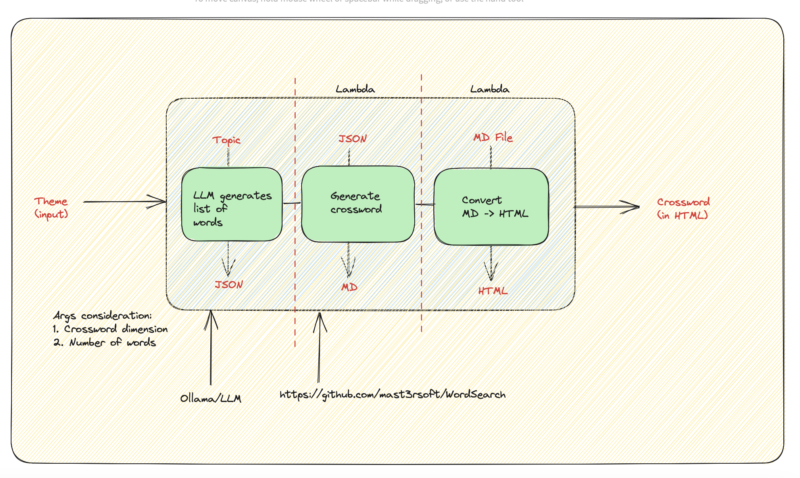

# Word Search Puzzle Generation

## Aim
The idea is to leverage LLMs and serverless architecture to handle the generation of word search puzzle from start to end.

## Architecture


## Features
- [X] Word Search words generation using ollama
- [X] Word Search words generation using openai
- [X] Puzzle generation
- [X] Puzzle for end users (HTML)
- [ ] Puzzle for end users (PDF)
- [ ] Custom Puzzle Dimension
- [ ] Words Validation
- [ ] Safe Words

## Deploying the stack
1. Ensure you have AWS CLI, AWS CDK and Docker installed
2. Run `cdk deploy` to deploy the stack
3. Done!

## Word Generation
Prerequisite: You will to the endpoint to your ollama server. Read more on ollama [here](https://ollama.ai)
```bash
  $ python3 scripts/ollama-word-generate.py "cartoon characters" "llama2:13b" "http://localhost:11434" > /tmp/test.json
  $ cat /tmp/test.json
    {
      "title": "Solar System",
      "0": "earth",
      "1": "mars",
      "2": "jupiter",
      "3": "saturn",
      "4": "uranus",
      "5": "neptune",
      "6": "sun",
      "7": "mercury",
      "8": "moon",
      "9": "pluto"
    }
```


## Puzzle Generation
Note: You can test the application by uploading a list of words to the deployed S3 (/words) and see 
the generated puzzle in your S3 (/puzzle)

```bash
$ aws s3 cp /tmp/test.json s3://<bucket-arn>/words/test.json
```

## Useful commands

 * `npm run build`   compile typescript to js
 * `npm run watch`   watch for changes and compile
 * `npm run test`    perform the jest unit tests
 * `cdk deploy`      deploy this stack to your default AWS account/region
 * `cdk diff`        compare deployed stack with current state
 * `cdk synth`       emits the synthesized CloudFormation template
